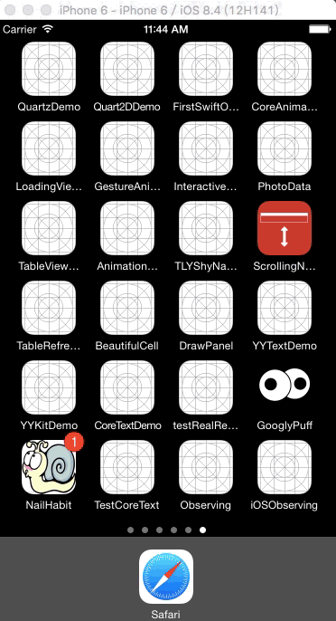

# iOSObserving
iOS观察者模式学习 <br>
（1）KVC与KVO简介<br>
 
 * KVC
 > KVC（Key-value coding）是一种间接更改对象状态的方式。<br>
 官方文档描述：<br>
 Key-value coding is a mechanism for accessing an  object’s properties indirectly, using strings to identify properties, rather than through invocation of an accessor method or accessing them directly through instance variables. In essence, key-value coding defines the patterns and method signatures that your application’s accessor methods implement.

 * KVC的作用<br>
 >通过键值的方式访问对象或者修改对象的值<br>
 比如：NSString *name = [car valueForKey: @"name"];通过-valueForKey:获取对象，它会先查找以参数名命名（格式为-key或-isKey）的getter方法，对于上面的调用，valueForKey:会先寻找-name方法。如果没有这样的getter方法，它将会在对象内寻找名称格式为_key或key的实例变量。通过使用KVC，没有相关getter方法也能获取对象，不需要通过对象指针来直接访问实例变量。<br>
  
 * KVC的优缺点<br>
 >1.KVC可以轻松处理集合类。（如：NSArray）<br>
 2.KVC没有相关getter方法也能获取对象，不需要通过对象指针来直接访问实例变量<br>
 3.简化代码<br>
 4.KVC需要解析字符串，速度比较慢<br>
 5.编译器无法进行错误检查<br>
 
 * KVO
 >KVO（Key-value Observing）是基于KVC的，一种监听方式，也就是所谓的观察者模式。<br>
 官方文档描述：<br>
 Key-value observing provides a mechanism that allows objects to be notified of changes to specific properties of other objects. It is particularly useful for communication between model and controller layers in an application.
 
（2）KVC代码实现<br>

```
//1.setValue: forKey
[car setValue: @"奔驰" forKey: @"name"];
[car setValue: [NSNumber numberWithFloat: 80] forKey: @"speed"];
[car setValue: @"黑色" forKey: @"carPaint"];

//1.valueForKey
NSString *name = [currentCar valueForKey: @"name"];
NSNumber *speed = [currentCar valueForKey: @"speed"];
NSString *carPaint = [currentCar valueForKey: @"carPaint"];

//2.setValue:forKeyPath
[car setValue: [NSNumber numberWithFloat: 40] forKeyPath: @"engine.horsepower"];
self.showCarDetail.text = [self showCarDetail: car];

//2.valueForKeyPath
NSNumber *horsepower = [currentCar valueForKeyPath: @"engine.horsepower"];

//3.整体操作:访问数组，如果使用某个键值来访问一个NSArray数组，它实际上会查询相应数组中的每个对象，然后将查询结果大包到另一个数组并返回，但是不能直接在建路径中索引这些数组，如：tires[0].pressure
NSArray *pressures = [currentCar valueForKeyPath: @"tires.pressure"];
NSLog(@"%@", pressures);

//4.快速运算@count,@sum,@avg,@min,@max,@distinctUnionOfObjects
NSNumber *count = [currentCar valueForKeyPath: @"tires.@count"];    //对左边键值返回数组操作，获取数组数量
NSNumber *sum = [currentCar valueForKeyPath: @"tires.@sum.pressure"];    //对左边键值返回数组操作，获取每个数组里面的pressure值，求和
NSNumber *avg = [currentCar valueForKeyPath: @"tires.@avg.pressure"];    //对左边键值返回数组操作，获取每个数组里面的pressure值，求平均值
NSNumber *min = [currentCar valueForKeyPath: @"tires.@min.pressure"];    //对左边键值返回数组操作，获取每个数组里面的pressure值，找出最小值
NSNumber *max = [currentCar valueForKeyPath: @"tires.@max.pressure"];    //对左边键值返回数组操作，获取每个数组里面的pressure值，找出最大值
NSArray *tireType = [currentCar valueForKeyPath: @"tires.@distinctUnionOfObjects.pressure"];    //对左边键值返回数组操作，获取每个数组里面的pressure值，去掉重复的值，返回一个包含所有不重复值的数组
NSLog(@"TiresCount: %@ Sum: %@, Avg: %@, Min: %@, Max: %@, TireType: %@", count, sum, avg, min, max, tireType);

//5.批处理
//字典里面不能为nil，如果返回值有nil，则KVC会自己处理，将返回[NSNull null]表示nil
//<null>和(null)的区别：前者是[NSNull null]对象，而后者是正真的nil。
NSArray *keys = [NSArray arrayWithObjects: @"make", @"modelYear", @"numberOfDoors", nil];
NSDictionary *carValues = [currentCar dictionaryWithValuesForKeys: keys];
NSLog(@"%@", carValues);
    
//6.nil处理
//可以自己运行一下，重写和没有重写setNilValueForKey:方法的代码
[currentCar setValue: nil forKey: @"speed"];
NSLog(@"carSpeed: %@", [currentCar valueForKey: @"speed"]);
    
//7.处理未定义的值
[currentCar setValue: [NSNumber numberWithFloat: 1500] forKey: @"mileage"];
[currentCar setValue: [NSNull null] forKey: @"price"];
[currentCar setValue: nil forKey: @"capacity"];
NSLog(@"Mileage: %@ Price: %@, Capacity: %@", [currentCar valueForKey: @"mileage"], [currentCar valueForKey: @"price"], [currentCar valueForKey: @"capacity"]);

//8.KVC有自动装箱的功能，当使用valueForKey时，它自动将标量值（int,float,struct...）放入NSNumber或NSValue中；当使用setValueForKey，它自动将标量值从这些对象取出。

```

（3）KVO代码实现<br>

```
//应该在监听者里添加监听，而不是在被监听者里添加监听
//在被监听者添加监听会造成循环引用的问题
car = [[Car alloc] init];
[car addObserver: self forKeyPath: @"carPaint" options: NSKeyValueObservingOptionNew | NSKeyValueObservingOptionOld context: nil];

- (void)observeValueForKeyPath:(NSString *)keyPath ofObject:(id)object change:(NSDictionary<NSString *,id> *)change context:(void *)context {
    if ([keyPath isEqualToString: @"carPaint"]) {
        NSLog(@"%@", [change objectForKey: @"new"]);    //修改之后的值
        self.showCarDetail.text = [NSString stringWithFormat: @"车的颜色是%@", [change objectForKey: @"new"]];
    }
}

- (void)dealloc {
    //监听者应该是self，被监听者是car
    [car removeObserver: self forKeyPath: @"carPaint"];
}

```

(4)Demo展示：



[Demo下载](https://github.com/jashion/iOSObserving)